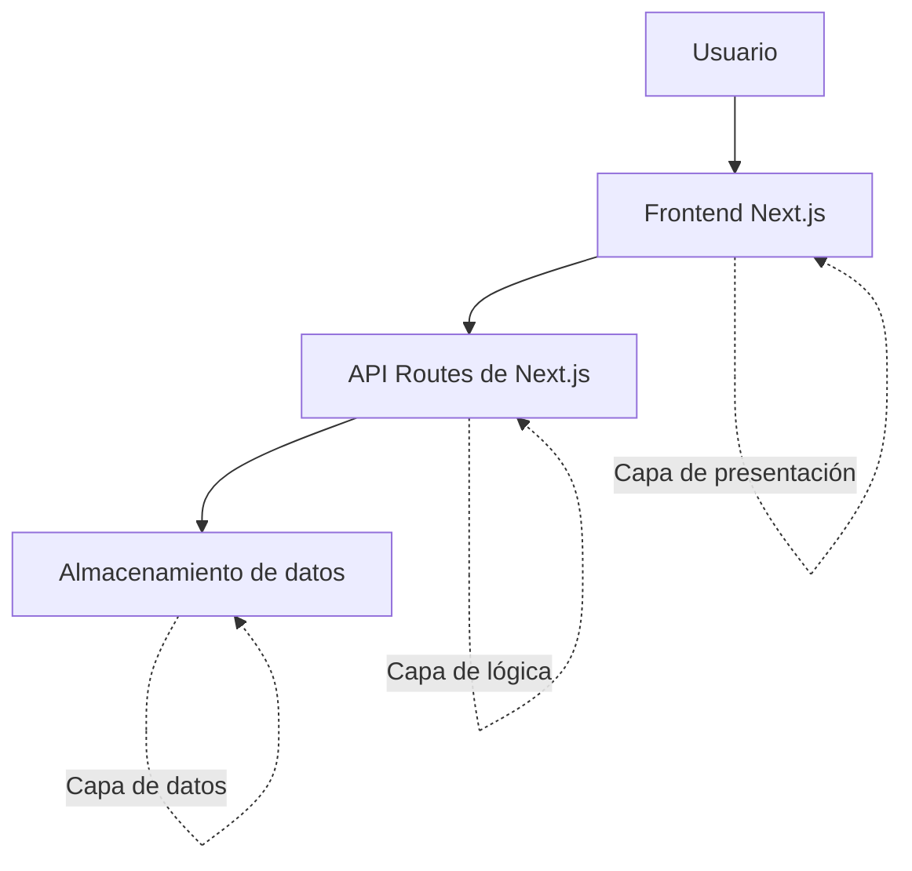

# Gestor de Solicitudes

Plataforma web desarrollada con Next.js para la gestión de solicitudes de soporte, permisos y requerimientos.

## Alcance

- Frontend base con navegación.
- Pantallas de inicio de sesión, registro y gestión de solicitudes.
- Arquitectura de tres capas.
- Enfoque serverless.

## Arquitectura del sistema

La aplicación se organiza mediante una arquitectura de tres capas:

1. **Capa de presentación:** contiene las páginas y componentes que utiliza el usuario.
2. **Capa de lógica:** procesa las solicitudes mediante las rutas API de Next.js.
3. **Capa de datos:** almacena la información utilizada por la aplicación.

## Tecnologías

- Next.js
- React
- TypeScript
- Tailwind CSS
- Node.js

## Rutas disponibles

- `/` — Página principal
- `/login` — Inicio de sesión
- `/register` — Registro de usuario
- `/solicitudes` — Gestión de solicitudes

## Estado del proyecto

Semana 1 – Diseño y frontend base.